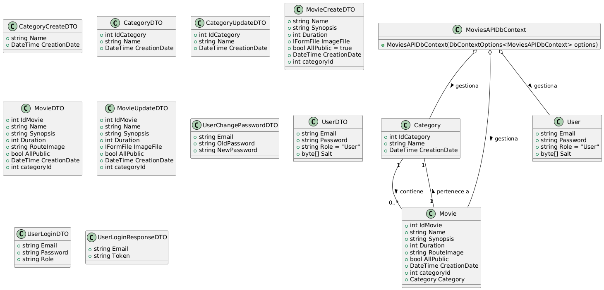
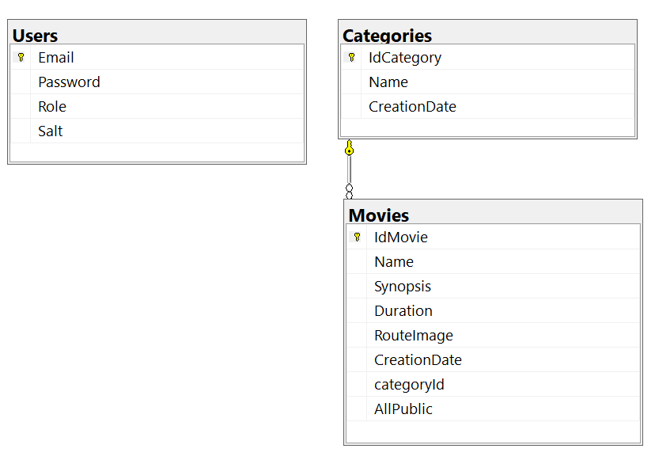

## MoviesAPI

**MoviesAPI** is a movie web API in ASP.NET Core. It includes controllers to manage user authentication, movie categories, movies, and users, using DTOs to structure the information. Services and repositories are used for business logic and data access through Entity Framework Core with SQL Server. Security is handled with JWT authentication, and data validators are implemented. Additionally, there are services for file management and password hashing, and AutoMapper is used for transformations between models and DTOs.



MoviesAPI/  
├───Classes  
│   └───HashResult.cs    
├───Controllers/  
│   ├───AuthController.cs    
│   ├───CategoriesController.cs    
│   ├───MoviesController.cs    
│   └───UsersController.cs    
├───DTOs/  
│   ├───CategoryCreateDTO.cs  
│   ├───CategoryDTO.cs    
│   ├───CategoryUpdateDTO.cs    
│   ├───MovieCreateDTO.cs    
│   ├───MovieDTO.cs    
│   ├───MovieUpdateDTO.cs    
│   ├───UserChangePasswordDTO.cs    
│   ├───UserDTO.cs    
│   ├───UserLoginDTO.cs  
│   ├───UserLoginResponseDTO.cs  
│   └───UserRegistrationDTO.cs  
├───Models/
│   ├───Category.cs  
│   ├───Movie.cs  
│   ├───MoviesAPIDbContext.cs  
│   └───User.cs  
├───MoviesMappers/  
│   └───MoviesMapper.cs  
├───Repository/  
│   ├───CategoryRepository.cs  
│   ├───ICategoryRepository.cs  
│   ├───IMovieRepository.cs  
│   ├───IRepository.cs  
│   ├───IUserRepository.cs  
│   ├───MovieRepository.cs  
│   └───UserRepository.cs  
├───Services/  
│   ├───CategoryService.cs  
│   ├───FileManagerService.cs  
│   ├───HashService.cs  
│   ├───ICategoryService.cs  
│   ├───IFileManagerService.cs  
│   ├───IMovieService.cs  
│   ├───IService.cs  
│   ├───ITokenService.cs  
│   ├───IUserService.cs  
│   ├───MovieService.cs  
│   ├───TokenService.cs 
│   └───UserService.cs  
├───Validators/  
│   ├───FileTypeValidator.cs  
│   ├───GroupFileType.cs  
│   └───WeightFileValidator.cs  
├───appsettings.json
└───Program.cs


## Program
```cs
builder.Services.AddDbContext<MoviesAPIDbContext>(options =>
    options.UseSqlServer(builder.Configuration.GetConnectionString("Connection"))
);
``` 

## appsetting.Development.json
```cs
{
  "ConnectionStrings": {
        "Connection": "Server=*;Database=MoviesAPI;Trusted_Connection=True;TrustServerCertificate=True;MultipleActiveResultSets=True"
}
``` 



[DeepWiki moraisLuismNet/MoviesAPI](https://deepwiki.com/moraisLuismNet/MoviesAPI)
