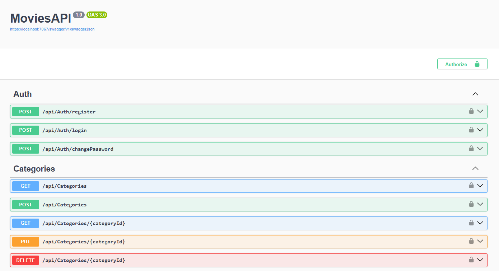
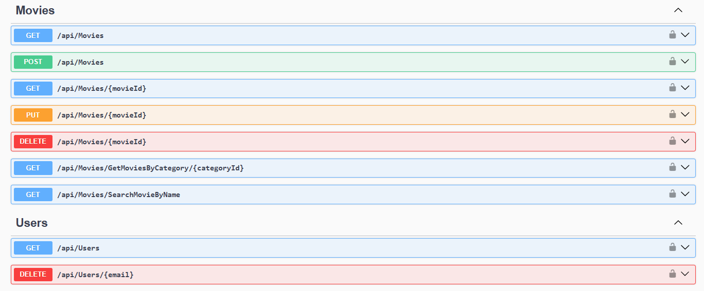

## MoviesAPI
ASP.NET Core Web API MoviesAPI






## Program
```cs
builder.Services.AddDbContext<MoviesAPIDbContext>(options =>
    options.UseSqlServer(builder.Configuration.GetConnectionString("Connection"))
);
``` 

## appsetting.Development.json
```cs
{
  "ConnectionStrings": {
        "Connection": "Server=*;Database=MoviesAPI;Trusted_Connection=True;TrustServerCertificate=True;MultipleActiveResultSets=True"
}
``` 

[DeepWiki moraisLuismNet/MoviesAPI](https://deepwiki.com/moraisLuismNet/MoviesAPI)
